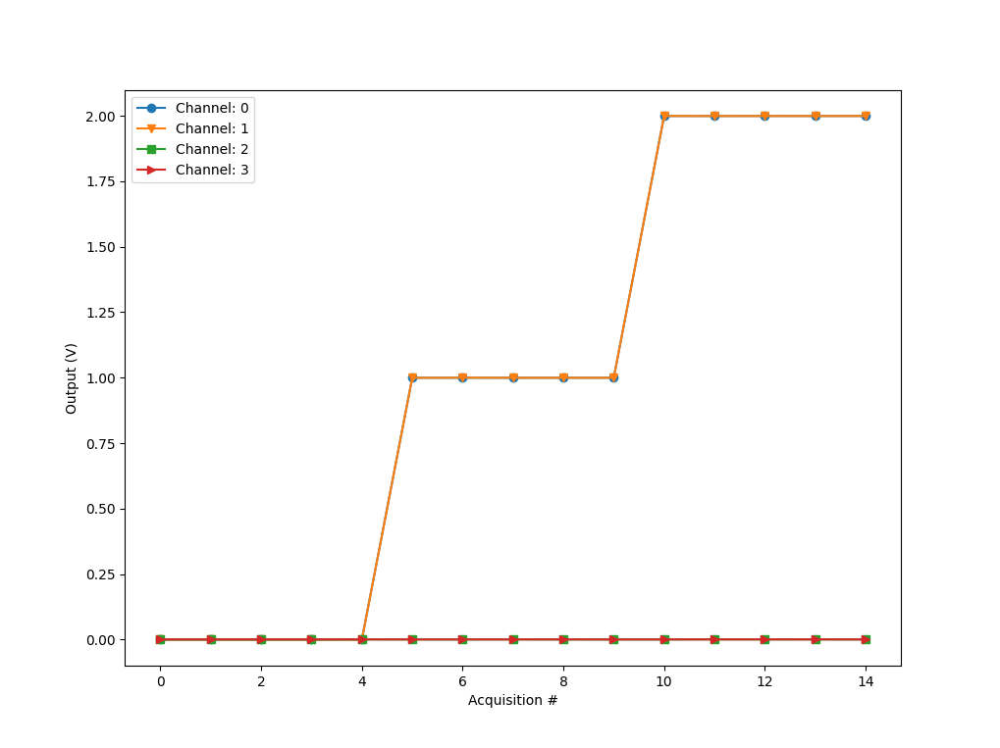

# QY-DAQInterface
 
 **_Under developement_**

 Python code to for NI-Daq control. More info will be updated soon. 

 ## Description
  **_Under developement_**
 
 ## Installation instruction
 **_Under developement_**
Make sure to have NIDAQMX driver installed.

Assuming that you have python installed and pip.
Run: `pip install -r ./setup/requirements.txt`

## Folder structure

+ [setup/](./setup/): Auxiliar files to install required packages
+ [docs/](./docs/): Manuals and Ni-DAQ6212 datasheets
+ [data/](./data/): Folder where the acquired raw-data is saved
+ [output/](./output/): png plots are saved
+ [scripts/](./scripts/): Python scripts to control the DAQ, create plots, manage the data, etc.

 
 ## User manual
 **_Under developement_**

 ## Output example:

### Contact info:

**Author** Jean Matias || **email**: jean.matias@tyndall.ie 