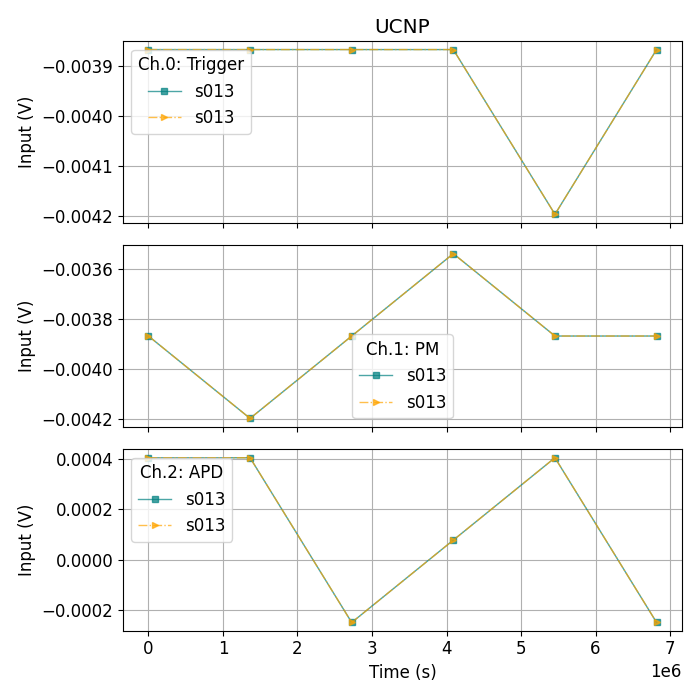

# QY-DAQInterface
## QyApp v2.0.0

Available for production environment on MS Windows, MacOS and Linux.

## Description
This software is able to control NI-DAQ ports (input and output). 
The main application for the current version is to modulate a laser driver using one of the output ports of the DAQ in order to excite upconverting nanoparticle samples and acquire their emission and transmission using the input ports.
 
## Installation instruction

The installation requires **_Python 3.4_** or above versions as well as its package manager (_pip_). Once python is installed:

1. Download all the content from https://github.com/Biophotonics-Tyndall/QY-DAQInterface/tree/master
2. Open the folder [setup](/setup) and double-click the [install.bat](./setup/install.bat) file.
3. To open the CLI, return to the root folder and double-click the [QYAPPv110](./QyAPPv110.bat) file. 
4. To open the GUI, return to the root folder and double-click the [QY-GUIv200](./Qy-GUIv200.bat) file. 

Once installed, just repeat the step 3 or 4 to use the controller. 

## Running the controller

To use the controller make sure that the DAQ is connected to the computer by USB and it has installed its driver.

    ⚠️ For linux or MacOs the driver may not be available and should be installed manually if provided by NI.

## Folder structure

+ [gui/](./gui/): Includes the code with a graphical user interface to control the QY system 
+ [setup/](./setup/): Auxiliary files to install required packages
+ [docs/](./docs/): Manuals and Ni-DAQ6212 datasheets. (This files might not be available on github repository)
+ [data/](./data/): Folder where the acquired raw-data is saved
+ [output/](./output/): png plots are saved
+ [source/](./source/): Python scripts to control the DAQ, create plots, manage the data, etc.

## User manual

### Graphical User Interface (GUI)
v2.0.0 includes a beta GUI of the controller. To start it, run the app.py file in the gui folder.

The parameters on the left hand side can be adjusted accordingly for the experiment.
The `Run` button sends the settings to the DAQ controller, which controls the actual device. Once the acquisition is completed, the data are plotted on the panel on the right. The `Save` button saves the data and settings in the data directory. Each dataset is stored with an unique id (date_time of the acquisition).      

### Command Line Interface (CLI)
For windows, on the root folder double click on _QyApp.bat_ file. This file will call python in a cmd and run the main code. The following user panel shall start. 

Done! Just follow the instruction on the screen.

## Output example:

With data acquired the data is displayed in a dynamic graph with one subplot per channel acquired. You can add all the channels needed for the experiment. 

### Contact info:

**Author** Jean Matias || **email**: jean.matias@tyndall.ie 

---

## Updates

v2.0.0 - GUI available

v1.1.0 - Minor update on measurement. New feature included
- [x] Include option on measurement to return laser current to 0 before ramping up to next step.
> List of changes:
> 1. `reset` option on config file
> 2. `step_reset` column included on log file
 
- [x] Include flag of data not saved on front panel
- [x] Bug! Matplotlib raising error: RuntimeError: main thread is not in main loop [description](output\logs\matplotlib_error_details.txt). Possible solution: pl.use("Qt5Agg") // or TkAgg or Agg. Details [here](https://youtrack.jetbrains.com/issue/PY-29872)
  
v1.0.1 - Minor changes and bugs fixed
- [x] Metadata columns renamed
- [x] Included channels connections to datalogs: ex.: ai1=PM
- [x] Bug on save data: Crashing after saved once